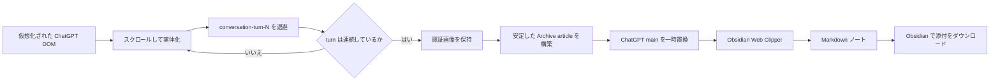

  

# ChatGPT Archive for Obsidian

長い ChatGPT 会話を **Obsidian Web Clipper** で欠落なく保存しやすくする、非公式の Chromium 拡張です。

ChatGPT Web の長い会話では、画面外の turn が DOM から外れ、仮想化用のプレースホルダーだけになることがあります。その状態で通常の Web Clipper を使うと、会話の途中が抜ける場合があります。本拡張は会話を自動巡回して各 `conversation-turn-N` を退避し、ユーザー添付画像を保持したうえで、Web Clipper が読み取れる安定した Archive 表示へ一時的に置き換えます。

> OpenAI / ChatGPT / Obsidian の公式プロジェクトではありません。

## 主な機能

- 仮想化された長文会話をスクロールして turn を実体化。
- `conversation-turn-N` が 1 から末尾まで連続していることを確認してから完了扱い。
- ChatGPT の認証付きユーザー画像をログイン中セッションで取得し、外部取得可能 URL または data URL として保持。
- 引用 favicon や操作ボタンなど、保存不要な UI を除去。
- ユーザー発言を `> [!question]+ User` Callout に変換できる安全なマーカーを挿入。
- Base64 画像を Interpreter に渡さない、テキスト専用コンテキストを別途生成。
- turn 欠落・画像処理の診断情報をコピー可能。
- テレメトリー、外部バックエンド、拡張機能ストレージなし。

## 必要なもの

- Chrome / Edge / Brave など Manifest V3 対応 Chromium ブラウザ
- Obsidian Web Clipper
- `web-clipper/` 内のテンプレート

## インストール

1. GitHub の **Code → Download ZIP** からリポジトリを取得し、展開します。
2. `chrome://extensions/` を開きます。
3. **デベロッパーモード**を有効にします。
4. **パッケージ化されていない拡張機能を読み込む**を選び、展開したフォルダを指定します。
5. ChatGPT のタブを再読み込みします。

リポジトリのルートをそのまま指定しても読み込めます。

## Web Clipper テンプレート

- `web-clipper/ChatGPT-Archive.ja.json`
- `web-clipper/ChatGPT-Archive.en.json`

既定の保存先は `WebClips` です。ご自身の Vault に合わせて変更してください。

## 使い方

1. ChatGPT の会話ページを開きます。
2. **ChatGPT Archive** を押します。
3. `準備完了 14/14` のように全 turn が連続取得できたことを確認します。欠落が表示された場合は保存しません。
4. Obsidian Web Clipper を開き、ChatGPT Archive テンプレートで保存します。
5. Obsidian で **Download attachments for current file** を実行し、画像を Vault の通常添付ファイルへ変換します。
6. **Restore ChatGPT** を押します。

## 画像ステータス

- `protected`: 元 URL が ChatGPT のログインセッションを必要とした画像
- `public`: 外部から取得可能な URL へ解決できた画像
- `inline`: data URL として Archive に自己完結化した画像
- `failed`: 保持できなかった画像

## 仕組み

詳細は [`docs/architecture.md`](docs/architecture.md) を参照してください。

## プライバシー

解析・テレメトリー・外部 API・独自バックエンドは使用しません。認証画像は、開いている ChatGPT ページから現在のログインセッションを利用して取得します。詳細は [`PRIVACY.md`](PRIVACY.md) を参照してください。

## 制約

- ChatGPT の DOM は公開 API ではないため、将来の UI 変更で壊れる可能性があります。
- 保存対象は現在選択されている会話ブランチです。再生成された全分岐を保存するものではありません。
- 長大な会話では巡回に時間がかかります。
- turn 欠落または画像 `failed` が出た場合、完全な Archive とみなさないでください。

## 先行事例と本プロジェクトの位置づけ

ChatGPT 会話を Markdown として保存する方法自体には、すでに複数の先行実装があります。長い会話や遅延読み込みへの対処も、既知の手段です。

- [otaliptus/chatgpt-markdown-exporter](https://github.com/otaliptus/chatgpt-markdown-exporter) は、ChatGPT 会話を Markdown / LaTeX へ書き出し、長い仮想化会話ではページをスクロールして取得した turn を結合します。
- [kandotrun/ai-chat-export-chrome-extension](https://github.com/kandotrun/ai-chat-export-chrome-extension) は、ChatGPT / Claude / Gemini を Markdown 化し、古い遅延読み込みメッセージを収集するため、エクスポート前に自動スクロールします。
- [jtsternberg/ChatGPT-Export](https://github.com/jtsternberg/ChatGPT-Export) は `data-*` 属性を利用した軽量な ChatGPT → Markdown 拡張で、長大な会話では現在の DOM に存在しないメッセージが欠落し得ることも README で明記しています。

本プロジェクトは、これらのような独立した Markdown exporter ではなく、**Obsidian Web Clipper の前処理層** として設計しています。主眼は、turn の連続性検証、認証が必要なユーザー添付画像の保持、Obsidian `question` Callout 用の前処理、favicon / UI ノイズ除外、Web Clipper Interpreter 用のテキスト専用コンテキスト分離です。

Web Clipper との連携は、Obsidian が公開しているテンプレート・変数・フィルターの仕組みを利用しています。上流仕様については [Obsidian Web Clipper の公式ドキュメント](https://help.obsidian.md/web-clipper) を参照してください。

## ライセンス

コードとプロジェクト文書は MIT License としています。ブランド名・商標については [`NOTICE.md`](NOTICE.md) を参照してください。
