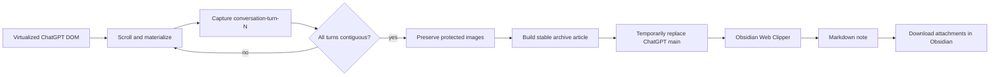

  

# ChatGPT Archive for Obsidian

An unofficial Chromium extension that prepares long ChatGPT conversations for reliable capture with **Obsidian Web Clipper**.

ChatGPT's web UI can virtualize long conversations: older turns may be removed from the live DOM and replaced with placeholder slots. A normal web clip can therefore save only part of a long thread. This extension scrolls through the conversation, captures every numbered turn, preserves authenticated user-uploaded images, and temporarily replaces the page body with a stable archive view that Obsidian Web Clipper can capture.

> This project is not affiliated with or endorsed by OpenAI or Obsidian.

## What it does

- Materializes virtualized ChatGPT turns by controlled scrolling.
- Verifies contiguous `conversation-turn-N` coverage before reporting success.
- Preserves ChatGPT-protected images with an authenticated same-origin fetch; if no public image URL is available, embeds the image as a data URL so it can later be downloaded into the vault.
- Removes favicon/UI noise while preserving conversation content and citations.
- Converts user turns into Obsidian `question` callouts through a conversion-safe marker.
- Provides a text-only Interpreter context so Base64 images are not sent to the Web Clipper Interpreter.
- Includes diagnostics with captured/missing turns and image preservation status.
- Uses no telemetry and no external backend.

## Requirements

- Chrome, Edge, Brave, or another Chromium browser supporting Manifest V3.
- Obsidian Web Clipper.
- One of the templates in [`web-clipper/`](web-clipper/).

## Install the extension

1. Download this repository with **Code → Download ZIP** on GitHub and extract it.
2. Open `chrome://extensions/` (or the equivalent page in your Chromium browser).
3. Enable **Developer mode**.
4. Choose **Load unpacked** and select the extracted extension folder.
5. Reload the ChatGPT tab.

The repository root itself is also loadable as an unpacked extension.

## Install the Web Clipper template

Import one of:

- `web-clipper/ChatGPT-Archive.ja.json`
- `web-clipper/ChatGPT-Archive.en.json`

The default destination is `WebClips`. Change it in Web Clipper settings to match your vault.

## Usage

1. Open a ChatGPT conversation.
2. Click **ChatGPT Archive**.
3. Wait for a status such as `Ready 14/14` / `準備完了 14/14`. Do not clip if turns are reported missing.
4. Open Obsidian Web Clipper and save with the ChatGPT Archive template.
5. In Obsidian, run **Download attachments for current file** to convert embedded/proxied images into normal vault attachments.
6. Click **Restore ChatGPT**.

### Image status

The archive status reports:

- `protected`: images that originally required the signed-in ChatGPT session.
- `public`: protected images that resolved to a fetchable public/signed URL.
- `inline`: images copied into the archive as data URLs.
- `failed`: images that could not be preserved.

## How it works

More detail: [`docs/architecture.md`](docs/architecture.md).

## Privacy

The extension has no analytics, no telemetry, no remote API, and no extension storage. Authenticated image fetches are made from the active ChatGPT page using the existing signed-in session. See [`PRIVACY.md`](PRIVACY.md).

## Limitations

- ChatGPT's DOM is not a public compatibility contract. A future UI change can break selectors or virtualization recovery.
- The extension captures the currently selected conversation branch, not every alternate regenerated branch.
- Very large conversations can take time to traverse.
- If the final status reports missing turns or failed images, do not treat the archive as complete.
- The Web Clipper template uses current Obsidian Web Clipper variables/filters and can require adjustment after upstream changes.

## Related projects and prior art

Exporting ChatGPT conversations to Markdown is an established approach, and several projects already address long or lazily loaded conversations:

- [otaliptus/chatgpt-markdown-exporter](https://github.com/otaliptus/chatgpt-markdown-exporter) exports ChatGPT conversations to Markdown or LaTeX and handles long virtualized conversations by scrolling the page and merging captured turns.
- [kandotrun/ai-chat-export-chrome-extension](https://github.com/kandotrun/ai-chat-export-chrome-extension) exports ChatGPT, Claude, and Gemini chats to Markdown and automatically scrolls before export so older lazily loaded messages can be collected.
- [jtsternberg/ChatGPT-Export](https://github.com/jtsternberg/ChatGPT-Export) is a lightweight ChatGPT-to-Markdown extension using stable `data-*` selectors; its README also documents the limitation that very long conversations may be truncated when messages are absent from the current DOM.

This project takes a different role: it is a **preprocessor for Obsidian Web Clipper**, rather than a standalone Markdown exporter. Its focus is contiguous turn verification, preservation of authenticated user-uploaded images, preparation of Obsidian `question` callouts, removal of favicon/UI noise, and a separate text-only context for Web Clipper Interpreter prompts.

The Web Clipper integration follows the public Obsidian Web Clipper template/variable model. See the [Obsidian Web Clipper documentation](https://help.obsidian.md/web-clipper) for the upstream behavior this project builds on.

## License

Code and project documentation are provided under the MIT License. See [`LICENSE`](LICENSE).

Brand names and marks remain the property of their respective owners. See [`NOTICE.md`](NOTICE.md).
