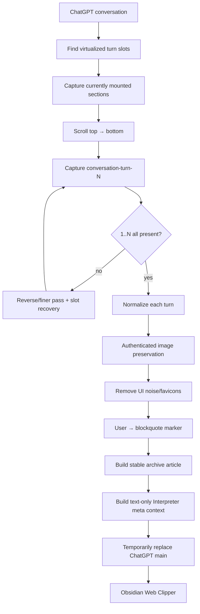

# Architecture

## Goal

The extension does not try to become another Markdown converter. Its role is to prepare a complete, stable DOM snapshot that **Obsidian Web Clipper** can process with its existing content extraction, Markdown conversion, properties, and Interpreter features.

## Pipeline

## Turn identity and completeness

The extension treats `data-testid="conversation-turn-N"` as the ordering key. Virtualizer slot count, mounted turn numbers, and captured turn numbers are compared to estimate the expected range. Completion is fail-closed: turn `1..N` must all exist in the capture map before the UI says the archive is ready.

This matters because a simple count can be misleading: ten captured elements are not sufficient if turn 4 is absent and turn 11 is present.

## Virtualization recovery

The current implementation performs:

1. Initial harvest.
2. Settle at the top.
3. Top-to-bottom pass in ~55% viewport increments.
4. Bottom-to-top pass if needed.
5. A finer ~30% pass if needed.
6. Per-slot recovery by scrolling virtualizer slot elements into view.
7. Final continuity check.

Captured turns are cloned into an extension-owned map, so a turn can later be unmounted by ChatGPT without being lost from the archive.

## Protected images

User uploads can use ChatGPT backend URLs that require an authenticated browser session. For these URLs the extension:

1. Fetches with `credentials: "include"` and follows redirects.
2. Uses a redirected non-ChatGPT HTTP(S) URL if it appears independently fetchable.
3. Otherwise converts the returned image Blob to a data URL.
4. Falls back to drawing an already-loaded image to canvas if the fetch fails.
5. Reports a `failed` count rather than silently pretending the image was preserved.

The data URL can then be converted into a normal vault attachment with Obsidian's **Download attachments for current file** command.

## Web Clipper compatibility

Rather than depending on a custom selector surviving Reader View, the extension temporarily replaces the ChatGPT `<main>` content with a clean `<article>`. This lets normal Web Clipper `{{content}}` extraction see the complete archive.

## Callout conversion

Writing `[!question]+ User` directly into HTML is unsafe because HTML-to-Markdown conversion can escape the brackets. The extension inserts an alphanumeric marker:

`CHATGPTARCHIVEUSERCALLOUT`

The Web Clipper template performs the final replacement after Markdown conversion:

`CHATGPTARCHIVEUSERCALLOUT` → `[!question]+ User`

## Interpreter context

Inline image data can be very large. A text-only representation of each captured turn is therefore stored in a temporary meta tag named `chatgpt-archive-context`. The supplied Web Clipper templates use this as Interpreter context while saving the image-bearing `{{content}}` as the note body.

## Failure model

The implementation intentionally exposes uncertainty:

- Missing turn numbers are shown and included in diagnostics.
- Image preservation failures are counted.
- The extension can restore the original ChatGPT DOM after clipping.
- No archive should be treated as complete when continuity or image checks fail.
